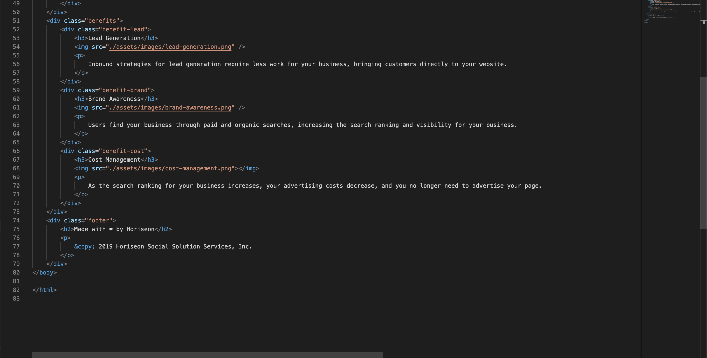

# Horiseon proyect
This readme lists and describes the changes that were made to the website initial code:

## <title>Horiseon</title> instead of <title>website</title> 
The new title was thinked for costumers to know in fact that the website is from the marketing agency "Horiseon".

## Semantic code changes
2.1.- <header> instead of 
 
Function: Identify the first block of information on the website.
2.2.- <figure> instead of 

 
Function: Identify the second block of information on the website that consists only of a background image.
2.3.- <main> instead of 
 
Function: Identify the most important block of information on the website.
2.4.- <aside> instead of 
 
Function: Identify the block of information located on the right side of the website.
2.5.- <footer> instead of 
 
Function: Identify the last block of information on the website.
2.6.- <section> instead of all remaining 
 
Function: Identify the information contained on each website block in a semantic way.

## Organized <h> elements:
Function: List headers from 1 to 4 each one agreeing to its website block, for example: <header> is the block of information number 1 so the headers inside it would be <h1>.
Function 2: Each header number has the same css attributes.
3.1.- <header> = <h1>
3.2.- <main> = <h2>
3.3.- <aside> = <h3>
3.4.- <footer> = <h5>  

## Added <alt> attributes 
Function: identify which image should be in that position if for some reason is not displayed on the website:
4.1.- alt="search-engine-optimization.jpg"
4.2.- alt="online-reputation-management.jpg"
4.3.- alt="social-media-marketing.jpg"
4.4.- alt="lead-generation.jpg"
4.5.- alt="brand-awareness.jpg"
4.6.- alt="cost-management.jpg"

## Removed <classes>
Function: Remove all class elements that weren't necessary to the code:
5.1.- .header
5.2.- .hero
5.3.- .benefits
5.4.- .footer

## Modified <classes>
Function: Change all class elements that had no descriptive attributes to optimize the understanding of the website code:
6.1.- .digital-marketing-meeting instead of .hero
6.2.- .lead-generation instead of .benefit-lead 
6.3.- .brand-awareness instead of .benefit-brand
6.4.- .cost-management instead of .benefit-cost

## New <id>
Function: Link the  <main> first <section> "search-engine-optimization" with <header> <nav> to navegate to it by clicking on the link:  
<a href="#search-engine-optimization">
7.1.- id="search-engine-optimization"

## Old code images:

## New code images:

## Github pages link:
https://andresplasenciaborja.github.io/Horiseon-proyect/
